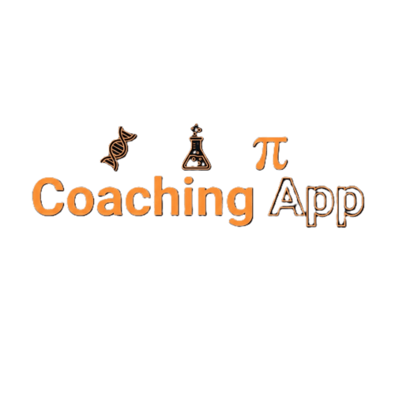

# 🎓 Brain Plus Academy App


> **Empowering Education via Digital Management**
>
> A comprehensive React Native & Expo application designed to streamline the academic experience for Students, Teachers, and Administrators. Developed by [igdevansh09](https://github.com/igdevansh09).

---

## 📋 Table of Contents
- [About the Project](#-about-the-project)
- [Key Features](#-key-features)
  - [For Administrators](#-admin-panel)
  - [For Teachers](#-teacher-panel)
  - [For Students](#-student-panel)
  - [Guest Access](#-guest-mode)
- [Screenshots](#-screenshots)
- [Tech Stack](#-tech-stack)
- [Getting Started](#-getting-started)
- [Configuration](#-configuration)
- [Project Structure](#-project-structure)
- [Contributing](#-contributing)
- [License](#-license)
- [Author](#️-author)

---

## 📖 About the Project

**Brain Plus Academy** is a multi-role educational platform that bridges the gap between institute management and learning. It features a secure role-based authentication system ensuring that Admins, Teachers, and Students access only the data relevant to them.

Whether it's tracking attendance, managing fees, uploading class notes, or watching demo courses, Brain Plus Academy handles it all with a sleek, dark-themed UI built with **NativeWind** and **Expo**.



---

## 🚀 Key Features

### 🛡 Admin Panel
*Complete control over the institute's operations.*
* **User Management**: Add, update, or remove Students and Teachers.
* **Financial Reports**: Track Student Fee statuses and Teacher Salary disbursements.
* **Content Management**: Manage Courses and upload global notices.
* **Leave Management**: Review and approve Teacher leave requests.
* **Notifications**: Send alerts to specific groups or the entire academy.

### 👨‍🏫 Teacher Panel
*Tools to manage classrooms efficiently.*
* **Classroom Management**: Mark attendance and assign homework.
* **Academic Updates**: Upload Class Notes and submit Test Scores.
* **Communication**: Notify students about important updates.
* **Personal Management**: View Salary status and apply for leaves.
* **Student Overview**: View profiles and details of assigned students.

### 👨‍🎓 Student Panel
*Your personal academic companion.*
* **Dashboard**: View attendance, test scores, and pending fees at a glance.
* **Learning Materials**: Access Class Notes, Homework, and Video Courses.
* **Administrative**: Apply for leaves and view fee history.
* **Notices**: Receive real-time global and class-specific notices.

### 👤 Guest Mode
* **Demo Access**: Browse and watch free demo video courses.
* **Easy Onboarding**: Seamless transition to a registered account.

---

## 🖼️ Screenshots

<p align="center">
  
</p>

*(More screenshots can be added here to showcase different panels and features.)*

---

## 🛠 Tech Stack

**Core:**
* **Framework**: [React Native](https://reactnative.dev/) (via [Expo SDK 50+](https://expo.dev/))
* **Routing**: [Expo Router](https://docs.expo.dev/router/introduction/) (File-based routing)
* **Language**: JavaScript / JSX

**Styling & UI:**
* **Styling**: [NativeWind](https://www.nativewind.dev/) (Tailwind CSS for React Native)
* **Icons**: @expo/vector-icons (Ionicons)
* **Components**: Custom Modals, Alerts, and Toasts.

**Backend & Services:**
* **Database**: Firebase Firestore
* **Authentication**: Firebase Auth (Persistent sessions)
* **Storage**: Firebase Storage (For notes and profile images)
* **Video**: react-native-youtube-iframe

---

## ⚡ Getting Started

Follow these steps to set up the project locally.

### Prerequisites
* Node.js installed
* Expo Go app on your physical device (or Android Studio/Xcode for emulators)

### Installation

1.  **Clone the repository**
    ```bash
    git clone https://github.com/igdevansh09/brain-plus-academy.git
    cd brain-plus-academy
    ```

2.  **Install dependencies**
    ```bash
    npm install
    ```

3.  **Start the server**
    ```bash
    npx expo start
    ```

---

## ⚙️ Configuration

This project uses **Firebase** for backend services. You must configure your environment variables.

1.  Create a `.env` file in the root directory.
2.  Copy the keys from your Firebase Console into the file:

```env
EXPO_PUBLIC_FIREBASE_API_KEY="your-api-key"
EXPO_PUBLIC_FIREBASE_AUTH_DOMAIN="your-project.firebaseapp.com"
EXPO_PUBLIC_FIREBASE_PROJECT_ID="your-project-id"
EXPO_PUBLIC_FIREBASE_STORAGE_BUCKET="your-project.appspot.com"
EXPO_PUBLIC_FIREBASE_MESSAGING_ID="your-messaging-id"
EXPO_PUBLIC_FIREBASE_APP_ID="your-app-id"
EXPO_PUBLIC_FIREBASE_MEASUREMENT_ID="your-measurement-id"
```

---

## 📁 Project Structure

The project follows a feature-based structure, organized by user roles.

```
.
├── app/                  # Main directory for all screens
│   ├── (admin)/          # Admin-specific routes
│   ├── (auth)/           # Authentication screens (Login, Signup)
│   ├── (guest)/          # Guest-specific routes
│   ├── (student)/        # Student-specific routes
│   ├── (teacher)/        # Teacher-specific routes
│   ├── _layout.jsx       # Root layout
│   └── index.jsx         # App entry point
├── assets/               # Images, icons, and fonts
├── components/           # Reusable UI components
├── config/               # Firebase configuration
├── context/              # AuthContext for session management
├── utils/                # Helper functions and schemas
├── .env                  # Environment variables (Firebase keys)
├── package.json          # Project dependencies
└── tailwind.config.js    # NativeWind styling configuration
```

---

## 🤝 Contributing

Contributions are what make the open-source community such an amazing place to learn, inspire, and create. Any contributions you make are **greatly appreciated**.

If you have a suggestion that would make this better, please fork the repo and create a pull request. You can also simply open an issue with the tag "enhancement".

1.  **Fork the Project**
2.  **Create your Feature Branch** (`git checkout -b feature/AmazingFeature`)
3.  **Commit your Changes** (`git commit -m 'Add some AmazingFeature'`)
4.  **Push to the Branch** (`git push origin feature/AmazingFeature`)
5.  **Open a Pull Request**

---

## 📄 License

Distributed under the MIT License. See `LICENSE` for more information.

*(Note: You will need to add a LICENSE file to the repository for this link to work.)*

---

## ✍️ Author

- **Devansh** - *Project Lead* - [igdevansh09](https://github.com/igdevansh09)

Project Link: [https://github.com/igdevansh09/brain-plus-academy](https://github.com/igdevansh09/brain-plus-academy)
